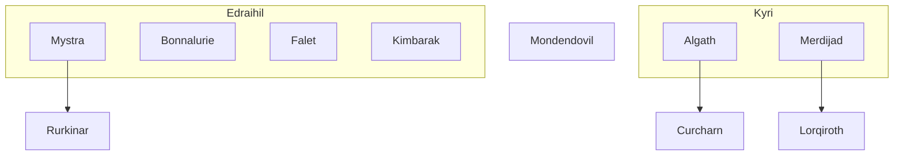

# Religions of Guemenos

## Nek and Ulkrunnar

In the beginning, before the birth of time, there were two proto-gods, Nek and Ulkrunnar. Nek was the master of light, while Ulkrunnar was the lord of darkness. Together, they formed a deadly alliance, and from their union came the world as we know it. Ulkrunnar's dark essence gave birth to the vastness of space, while Neks's light created the suns and time. But as with all alliances, there came a time when Nek and Ulkrunnar's egos clashed. Their struggle for power caused the world to shudder, and from the chaos emerged the first beings, each bearing a fraction of the proto-gods' power. And thus, the current world was born, ruled by the eternal balance of light and darkness. From Nek's fractions emerged The Edraihil while Ulkrunnar's created the Kyri. These two pantheons have always competed for influence in the world.

## Yotunn Ancestors

The Yotunn Acestors is one of the most important religion group on the continent. It was born during the fall of Mystra's pantheon, with which it was later consolidated under Tahlia. The Yotunn have, apparently, lived their apex one century ago, and are now in decline due to the Faletism takeover coming from the northwest.

### Mystra, the Lady of Mysteries

The world of Guemenos was a place of magic, where the forces of nature were intertwined with the mysteries of the arcane. At the center of this world stood the pantheon of Mystra, a group of gods and goddesses who were revered for their knowledge of magic and nature. The Mystran clergy were the guardians of this knowledge, tasked with preserving the lore of magic so that it could continue to flourish for generations to come. They worked tirelessly, poring over ancient tomes and scrolls, deciphering cryptic inscriptions, and performing complex rituals to unlock the secrets of the universe.

But there were those who coveted this knowledge, who sought to wield the power of magic for their own dark purposes. Among them was the sorceress Malora, a dark and twisted figure who had long lusted after the secrets of the Mystran clergy. Malora had amassed an army of followers, all eager to aid her in her quest for power. They stormed the temples of Mystra, their weapons clashing against the stone walls as they sought to breach the sanctums within. The Mystran clergy fought back with all their might, unleashing powerful spells and incantations in a desperate bid to protect their knowledge. But Malora was relentless, her dark magic tearing through their defenses and leaving a trail of destruction in her wake. In the end, the Mystran pantheon was shattered, their temples in ruins and their followers scattered to the winds. The clergy themselves were hunted down and executed, their knowledge lost to the ages.

But there was one among them who had managed to survive: a young acolyte named Tahlia. With the remaining knowledge and power of the Mystran clergy at her disposal, Tahlia began a new quest: to re-establish the creed of Mystra and empower the other gods and goddesses of the much younger Yotunn pantheon. She traveled the length and breadth of Guemenos, seeking out the remnants of the old pantheon and rallying them to her cause. With her unparalleled mastery of magic, she was able to restore their strength and imbue them with new power, building the traditions of the Yotunn Ancestors. Once Tahlua passed away she was given a special position within the pantheon, serving Rurkinar as an Angel Hound spirit.

### Rurkinar, the Brown Eagle

In the heart of the north desert, where the sun always shines on the endless sand dunes, lies the tranquil realm of Rurkinar, the Brown Eagle. Born from the union of the earth and sky, Rurkinar was gifted with wings to soar above the sands and a heart filled with compassion for all beings. Rurkinar's loyal companion is an angelic hound spirit, with fur as white as the moon and eyes that shine like diamonds. Together, they wander the vast expanse of the desert, bringing hope and wonder to all who cross their path. It is said that Rurkinar can hear the whispers of the wind and the songs of the sand, and that his angel hound spirit can run faster than the swiftest gazelle. In Rurkinar's realm, the sky is always clear, the sand dunes glow like molten gold, and the air is filled with the sweet scent of desert blooms. It is a bucolic oasis, where peace and harmony reign supreme amidst the arid landscape.

Rurkinar, the Brown Eagle, is the second highest deity in Mystra's pantheon, behind only Mystra herself. The Rurkinar followers, and cultists, are the most relevant Yotunn representation on the northeast (to the east of Mystra's).

The Rurkinar Cultists are a group of shamans that believe in direct communication with the Brown Eagle through rituals.

### Kimbarak, the Dwarven Spirit

For centuries, the dwarves had looked to Kimbarak, the great and powerful spirit of the Kiranu mountains, as their protector and savior. They praised his strength, his courage, and his unwavering commitment to justice and honour.

## Faletism

Falet, the Almighty Lord, is a revered deity worshipped by many inhabitants of Guemenos. The high church of Falet, situated in the region of Olivepia, holds significant influence in the empire through its powerful military organization. As the almighty lord of the realm, Falet is believed to have created the world and all its creatures, imbuing them with magic and power. The followers of Falet believe that the god is able to grant them blessings and favors, including divine protection and guidance in times of war. The military forces of the high church are renowned for their strength and strategic prowess, and are often called upon to defend the empire against external threats. The high priests of Falet hold great power and influence, and are widely respected and feared throughout the land of Guemenos.

## Trow Ancestors

The Trow Ancestors is a religion group with strong presence in the south of Easteros, and in most of the Ghost Domain.

### Algath, Goddess of Life and Death

In the darkness of the ancient temple, a group of hooded figures chanted in unison, their voices rising and falling in an eerie rhythm. They stood before a stone altar, upon which lay the remains of countless creatures: bones, feathers, fur, and scales. As the chanting grew louder, a sickly green light flickered to life, illuminating the twisted shapes of the figures. Suddenly, the air grew thick with the stench of death and decay, and the bones began to shift and writhe, as if possessed by a malevolent force. With a final, blood-curdling scream, the figures threw their arms wide, and from the maelstrom of bones emerged a figure, beautiful and terrible. This was Algath, Goddess of Life and Death, born of the sacrifice of countless creatures and the dark magic of her worshippers.

### Curcharn, the Boatman and Spirit of the Darklake

Algath and Curcharn had a tumultuous relationship, one that spanned both the worlds of the living and the dead. Algath, as the Goddess of Life and Death, was responsible for guiding the souls of the deceased to their final resting place, whether in the underworld or in the world of the living. Curcharn, on the other hand, was the boatman deity of the dark lake that separated these two worlds, ferrying souls across the treacherous waters.

At times, Algath and Curcharn worked together, their paths crossing as they guided souls to their final destination. But more often than not, their relationship was fraught with tension and animosity. Curcharn resented Algath's power and influence, believing that she overstepped her bounds and interfered with his role as the ferryman of the dead. Algath, for her part, saw Curcharn as a necessary evil, a means to an end rather than a true ally. She was wary of his unpredictable nature and the dark, murky waters he controlled, knowing that he could turn on her at any moment.

Their relationship was a delicate balance of power and mistrust, with each deity constantly watching the other, waiting for the opportune moment to strike. But despite their differences, they both recognized eachother's role in matters of life and death.

### Lorquiroth, Commander of Turnskull

Deep in the icy wastelands in the south lived a minor deity known as Frosthelm, the god of ice and war. Frosthelm had always been drawn to the frigid wilderness, where his powers were at their strongest, and the thrill of battle was never far away. However, he was not entirely alone in his icy domain, sharing it with his mighty companion, a dire polar werewolf named Frostfang. Together they roamed the vast expanses of the ice sheets, hunting prey and battling any foes that dared to challenge them. Frostfang was a fearsome creature, with gleaming white fur and eyes that shone like ice crystals. He was as much a part of Frosthelm's domain as the snow and the cold.

Once Merdijad came to Frosthelm with promise of untold power and glory, he eagerly sworn allegiance to her. Under the new name of Lorquiroth he joined her ranks as the loyal commander of her armies. From his throne in the legendary fortress of Turnskull in the ice sheets, together with Frostfang, Lorquiroth ruled the icy wastelands with an iron fist, feared and respected by all who dwelled there

## Ancient Deities

### Bonnalurie, the Artificer Queen

Once upon a time, the world was graced by the presence of Bonnalurie, the goddess of diligence, construction, and knowledge. Her followers revered her for her unyielding dedication to excellence and her unwavering commitment to hard work. They built magnificent temples and monuments in her honor, and her teachings formed the foundation of countless schools and universities. But as time passed, the worship of Bonnalurie began to fade. Her once-thriving temples lay abandoned and in ruins, and her followers scattered to the winds. A thousand years later, the memory of Bonnalurie and her creed have faded almost entirely from the world, known only to a select few scholars and historians. Yet some say that her spirit still lingers, waiting for the day when the world will once again embrace the values of diligence, construction, and applied knowledge that she embodied so completely.

### Mondendovil, the Mercian Forefather

Mondendovil, the Forefather of Mercian gods, was a being of immense power and ancient knowledge. His followers revered him as a god of magic, but his true nature was far more sinister than they could ever imagine. Mondendovil's obsession with the dark arts led him to create a secret school of magic known as the Wandering Crow, which delved into the most forbidden and dangerous practices imaginable. For centuries, the school flourished, attracting the most twisted and malevolent practitioners of the arcane. But as time passed, the knowledge of the Wandering Crow was lost, and the school faded into obscurity. But in the shadows of the forgotten school, something dark and malevolent still lingers. The whispers of Mondendovil's dark magic can still be heard, and those who dare to venture too close risk being consumed by the madness and horror that lie at the heart of the Wandering Crow

### Merdijad, Master of the Order of Strings

Merdijad is one of the most powerful gods of Guemenos. She is a manupulative goddess. Her subjects, blinded by their devotion, are unwitting pawns in her game of power. She whispers promises of greatness and eternal life to those who serve her without question, while using her divine abilities to sow discord and chaos among her enemies. With each victory, her power grews stronger, and her thirst for control more insatiable. And so, Merdijad continued to weave her web of deceit, her eyes fixed on the ultimate prize - the domination of the entire realm, and the subjugation of all who dared to oppose her.
