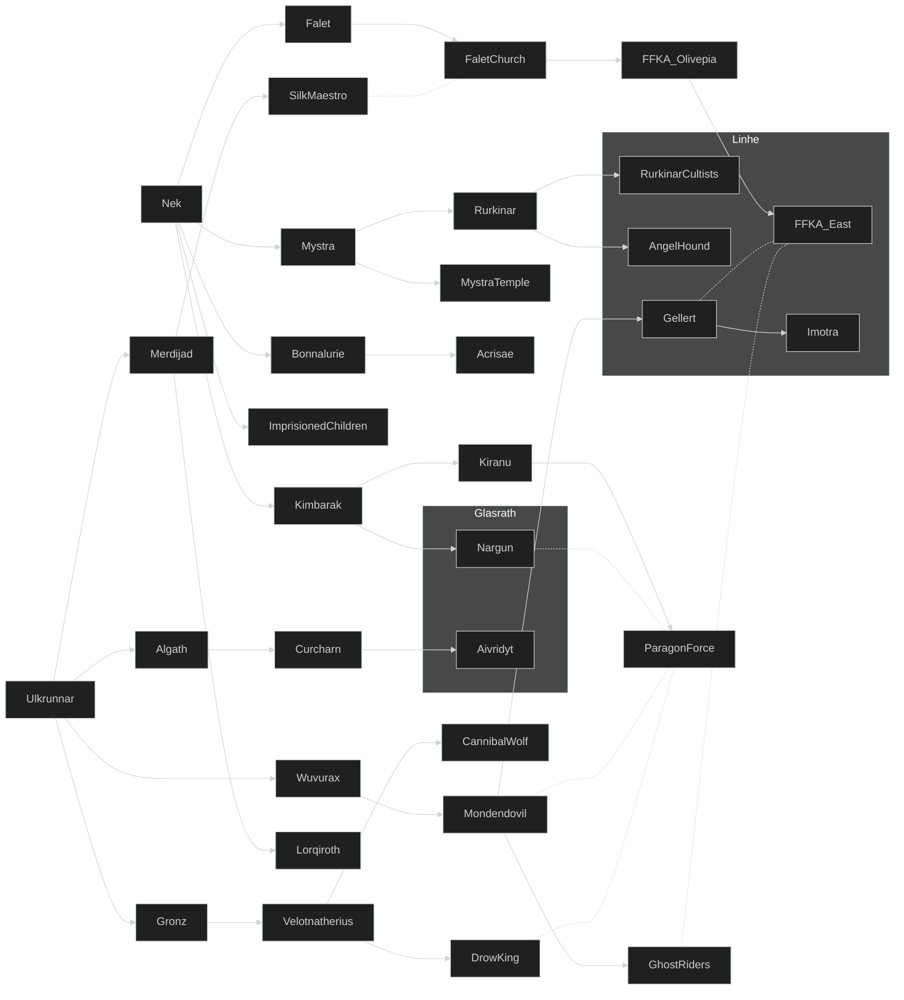

# Faction Game Log

| Faction   | Tier | Feat | Trouble       | Cohesion | Dominion |
| --------- | ---- | ---- | ------------- | -------- | -------- |
| Glasrath  | 2    | 2    | 3             | 2        | 3        |
| Rurkinar  | 2    | 1    | 4 (in crisis) | 2        | 0        |
| FFKA East | 2    | 2    | 3             | 2        | 1        |
| Mercians  | 3    | 4    | 3             | 3        | 12       |

### 3877.5B

**Actions**
- [Glasrath](factions/glasrath.md)
	- INT Build strength: 1d8 DC 4 to get 1 dominion. Outcome 5.
- [Rurkinar](factions/rurkinar.md)
	- INT Enact change: spend 2 dominion to get the feature to communicate with Rurkinar, 1d8 DC 4 to get the feature (success creates the feature but adds one trouble, failure expends the dominion points). Outcome 8.
- [FFKA East](factions/ffkaEast.md)
	- INT Build strength: 1d8 DC 4 to get 1 dominion. Outcome 5.
	- EXT Attack rival: Foil Rurkinar's ritual by imposing military presence during the ritual and imprison the cultists' shaman, 1d8 vs 1d8. Outcome 8 x 5: the High Shaman is now troubled and cannot use its power.
- [Mercians](factions/mercians.md)
	- INT Build strength: 1d10 DC 4 to get 2 dominion. Outcome 7.

**Summary before actions**

| Faction   | Tier | Feat | Trouble | Cohesion | Dominion |
| --------- | ---- | ---- | ------- | -------- | -------- |
| Glasrath  | 2    | 2    | 3       | 2        | 2        |
| Rurkinar  | 2    | 1    | 3       | 2        | 2        |
| FFKA East | 2    | 2    | 3       | 2        | 0        |
| Mercians  | 3    | 4    | 3       | 3        | 10       | 
