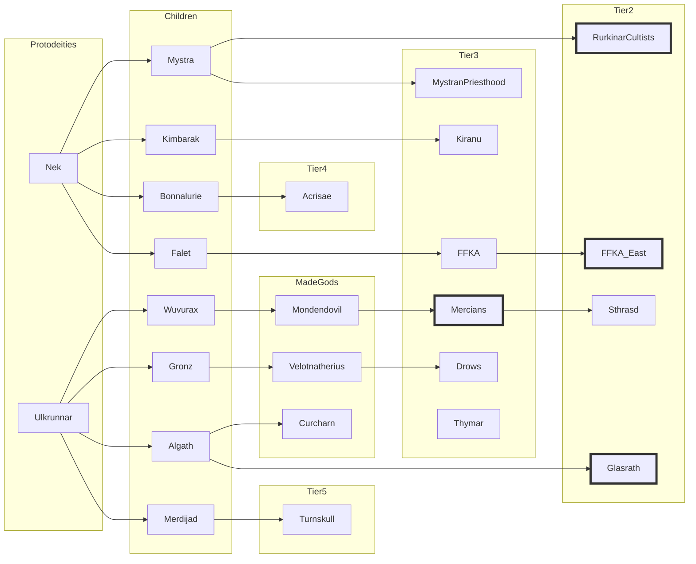

# Faction Game Log

## Current



```dataview
table without ID link(file.link, name) AS "Faction", tier AS "Tier", features AS "Features", trouble AS "Trouble", cohesion AS "Cohesion", dominion as "Dominion"
from "campaign/factions"
WHERE contains(type, "faction")=true
sort file.name asc
```


### 3877.5B

**Actions and updates**
- Glasrath
	- **INT Build strength**: 1d8 DC 4 to get 1 dominion. Outcome 5.
- Rurkinar
	- **INT Enact change**: spend 2 dominion to get the feature to communicate with Rurkinar, 1d8 DC 4 to get the feature. Outcome 8.
	- **Updates:**
		- Scene with the communication with Rurkinar and the new madness of the high shaman to happen in chapter.
		- The foil of the ritual should also create a new problem for the Rurkinar Cultists, maybe there is a big fight with the FFKA - to be detailed in chapter.
- FFKA East
	- **INT Build strength**: 1d8 DC 4 to get 1 dominion. Outcome 5.
	- **EXT Attack rival**: Foil Rurkinar's ritual by imposing military presence during the ritual and imprison the cultists' shaman, 1d8 vs 1d8. Outcome 8 x 5: a new problem is acquired for the Ruirkinar.
- Mercians
	- **INT Build strength**: 1d10 DC 4 to get 2 dominion. Outcome 7.

**Summary before actions**

| Faction   | Tier | Feat | Trouble | Cohesion | Dominion |
| --------- | ---- | ---- | ------- | -------- | -------- |
| FFKA East | 2    | 2    | 3       | 2        | 0        |
| Glasrath  | 2    | 2    | 3       | 2        | 2        |
| Mercians  | 3    | 4    | 3       | 3        | 10       |
| Rurkinar  | 2    | 1    | 3       | 2        | 2        |

### 3877.4E
***State of play in Part 2***


* Human factions pressing on the Nulfirth people
    * Mercian culture expanding and gaining territory NE -> SW
        * Which includes the introduction of the Lady Scurvy disease in the capital of Katho
    * FFKA extending and gaining territory NW -> SE
        * Which includes a failed attempt to take over the Holzander castle from the Mercian
* The Trow advancing from the south with his army of cannibal giants and devils towards Katho
    * Trow expanding from the south, in declared war with Katho
    * Katho not able to protect the region due to the disease in the capital, the southern provinces have to deal with the Trow without aid
    * Thymar will respond and help in the war
    * Kiranu will respond and help in the war, but populations might need to migrate
* Aivridyt taking dominion in the Glasrath mountains, and travelling back and forth to the Dark Lake to look after her eggs
* Acrisae set in the middle, pushing peoples to the borders to avoid the enemy knowing their position and intent