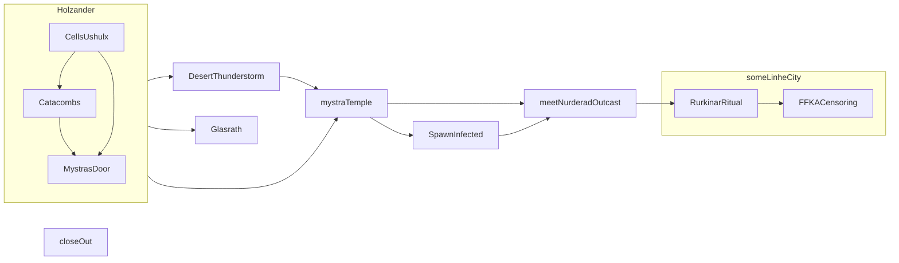

# Chapter 7 Holzander Ancestral Shrine

## Reviews for planning
***Delete from template after done***

- [x] Summarise previous chapter
- [x] Review [Abridged](../context/abridged.md)
- [x] Review and organise [Notions](../../notions.md)
- [x] Think about characters, write motivations & links
- [x] Define party level, easy DC, deadly CR, XP and treasure benchmarks
- [x] Review [Fronts](../factions/_fronts.md) and check if new front has materialised
- [x] Review [Factions](../factions/_factionGame.md) and run one [faction turn](../../rules/factionRules.md), if applicable
- [x] Decide what NPCs are doing, and their respective checks
- [x] Detail strong start
- [x] Think and write potential scenes
- [x] Choose secrets & clues
- [x] List fantastic locations
- [x] List potential NPCs
- [x] Link potential foes
- [x] Define treasure
- [x] Check secrets from 30/oct
- [x] Prepare Owlbear, if applicable
- [x] Add Danaska
- [x] Add Imortra to NPCs
- [x] Move big texts to appendix in the file

## Characters' motivations & links


- **Dolman**: get information on [Gaelira](../npcs/gaelira.md)'s torment
- **Miraak**: meet [Gulthas Morseth](chap007.md#^Gulthas) and learn more about being an undead
- **Guilf**: feel the censoring of [FFKA](../factions/ffkaEast.md) again
- **Amyria**: learn more about the [Ammuinoth](../context/realms.md#Ammuinoth) and the Brezal Paths
- **Kethra**: through [Gulthas Morseth](chap007.md#^Gulthas) possibly realise that Ghuse is [Aivridyt](../npcs/aivridyt.md)

## Intro
- Read aloud:
	- [Abridged for chapter 6](https://github.com/efsalvarenga/arrival_open/blob/main/context/abridged.md#chapter-6-the-torturer-of-holzander)
	- [Linhe](https://github.com/efsalvarenga/arrival_open/blob/main/context/realms.md#linhe)
	- [Rurkinar](https://github.com/efsalvarenga/arrival_open/blob/main/context/religions.md#rurkinar)

## Strong start
A resting conversation with [Ushulx](../npcs/ushulx.md), Dugan, Red Hart, Ichbon about the current lore, touching subjects such as:
- [ ] Ushulx searching for Aivryndt, who went to the Deadecho and was blessed by [Algath](../npcs/algath.md) herself
- [ ] The Holzander catacombs are rife with undead, thanks to a weak spot in the dimensional barrier between here and the Deadecho
- [ ] The Deadecho, the dominion of [Algath](../context/religions.md#Algath) (and the equally notorious Vardesain and Anu-Akma, fellow demigods of the dead), is notable for its silence - an existence of enormous deserts of bones, dunes of dust, and rivers of blood and tears. These are the dry lands, where life extends past its appointed span, where fate itself is thwarted with regularity, and where liches, vampires, and ghouls gather in enormous numbers to praise their patron and the font of vileness, to cheat death, to praise their protection against a certain voyage into the hells and the joy and strength of the god of the undead and his near-infinite legions.
- [ ] Closing the portal requires more than just traditional magic or arcane manipulation. A darkness deep below the Scarlet Citadel is responsible for the open wound leading to the Dry Lands.
- [ ] Location of Mystra's door in the castle
- [ ] Ichbon researching the Lady Scurvy
- [ ] Traders mentioning the desert is getting colder and even more bare
- [ ] Torture of Gaelira (including screaming the name "Angel Hound"), which stoped and she was sent downstairs
- [ ] Other conversation points from below:

 

## Potential scenes



**Catacombs and vision of the Ophaire (as set out in SC45)** ([Pool portal to the Ophaire](chap007.md#Pool%20portal%20to%20the%20Ophaire) and [Ophaire undead encounter](chap007.md#Ophaire%20undead%20encounter))
- Threat: PCs may think there is something here, but except for the information of the Ophaire, there is nothing. 
- Conflicts: Incoming undead never stops
- End conditions: The PCs realise there is nothing here for them.

**Mystra's door** [Mystra's Door in the tunnel](chap007.md#Mystra's%20Door%20in%20the%20tunnel)
- Draw: Learn where the door is located for finding it from above

**Arrival in Glasrath**
- More alignment with Ghuse than before. Too many undead working on the mines. Trading is working well.

**Ardismouth to desert thunderstorm** ([Desert thunderstorm encounter](chap007.md#Desert%20thunderstorm%20encounter))
- Location: Exit from the Ardismouth temple
- Threat: Pressured by frost goblins and a thunderstorm with an elemental
- Conflict: When characters reach the Ardismouth temple, it is now a camp of frost goblins - they are famished and would attempt to kill the characters to eat them, it is possible to dodge them, and go to the desert - but they might follow. In the desert there is an immense thunderstorm. In the thunderstorm, water elementals are present. If the characters go out, engage, and come back to the Ammounith, the elemental will follow them.
- End conditions: Thunderstorm passes (elemental will go away too, if not killed); Characters give up on this exit; Goblins are dealt with

**Mystra's Temple** ([location link](../locations/templeMystra.md))
- Draw: Find the password for Mystra's door
- Give hint that the Rurkinar have been trying to communicate with the Angel Hound, with no success, and that a festival and ritual on his behalf will happen in [eyaram](../locations/eyaram.md)
- NPCs in the temple are: priests, cultists and traders (commoners)

**Lady scurvy infected** ([Spawn encounter](chap007.md#Spawn%20encounter))
- Scene: At night, a collapsed statue and ruins. An adolescent-shaped hooded humanoid is walking around, sounds of sobbing. She is actually a vampiric mind flayer.
- Dramatic question: overshadowing a different lady scurvy
- Sources of conflict: Spawns are hungry
- End conditions: Spawns are dealt with

**Meet Nurderad outcast** ([[chap007.md#]])
- Scene: While travelling, they meet Gulthas Morseth, a dragonborn outcast from north Nurderad.
- Dramatic question: Information on the battlemage Grezar ([Aivridyt](../npcs/aivridyt.md)) and the attack under his influence. Outcast has been living alone in the north desert for the last 10 years - ashamed to come back to Nurderad.

**Rurkinar festival and ritual, and FFKA censoring**
- Scene: Arrival in one of the Linhe cities - Rukinar festival and ritual is happening, [FFKA](../factions/ffkaEast.md) is in position and ready to censor the cultists.
- Consider having Imortra observing.
- Tense situation that ends up with the cultists imprisoned.
- [Sergarus](../npcs/sergarus.md) arrive in the next day to interrogate cultists.
- The ritual finally completes in an unexpected way: the Angel Hound communicates with [Imra Advyre](../factions/rurkinar.md#^imraAdvyre) in imprisoned in the lost castle of the Holzander's.
- Imra becomes troubled and mad.
- Something else has to create a problem - tbd at table.

> **Mad poem about the staff**
> 
> *Mmm... the staff, the Thalia's one,
> It's got the power, oh yes, it's second to none,
> Lightning and thunder, its magic can stun,
> She imbued the gods, and their power she spun.
> 
> Thalia was an acolyte, young but wise,
> She brought the old pantheon to rise,
> Restored their strength with magic ties,
> And now she serves as an Angel in the skies.*

## Information Pool

**Factions (1 to 3)**
- [ ] Lady Scurvy linked with a specific type of death lycanthropy that have arrived in the region of Katho about an year ago - source of death lycanthropy in old ages to the south east
- [ ] FFKA very little knowledge about the castle - and just a bunch of religious bullies
- [ ] A fire demon knight is the messenger between Gellert and the high septon of Mondendovil, the Forefather

**Context (1 to 3)**
- [ ] **Major secret (i.e. gold dragons, undead horde, etc.) exists in an ancient elven library in the Holzander**
- [ ] Avrindyt, the Creep, the red dragon who a legend say was blessed into a deep death dragon by Algath herself
- [ ] Music about the Glasrath heroes that saved the mountains and then died in the tunnels.
- [ ] The monuments, tombs, and pyramids of past golden ages litter Linhe. These countless tombs are interconnected, forming a vast, semi-hidden underground network through the Ammuinoth and the Ghost Domain.
- [ ] Linhe is a land of vast deserts and rare, but deadly, storms.


**Advancing arcs (2 to 4)**
- [ ] Cagoth-ze and Danaska Maksilov's works in the second level
- [ ] Torture of Galiera and the calling for the Angel Hound
- [ ] Dark thunderstorms a becoming very frequent and the [Desolate Flats](../context/environments.md#Desolate) are becoming even more bare - related to the weakening of the Angel Hound spirit (and the Brezal Paths energy overflowing)
- [ ] Every few months, on the night of the new moon, hordes of undead appear from the Ghost Domain and invade Linhe.

**Rumours (2)**
- [ ] Foucheresia is joining Katho in the war, and sending the Thymar host south
- [ ] Agents of Silk have captured Daardendrien Turan, the Nurderad clan elder and replaced him with a puppet

## Fantastic locations

### Pool portal to the Ophaire


:no_upscale()/cdn.vox-cdn.com/uploads/chorus_image/image/65197198/descent_art.0.jpg)

### Mystra's Door in the tunnel


### Rurkinar flooded hall

A flooded monumental hall of brass, in terrible decay, with sweeping passageways encircled by a graveyard. The construction follows the [Iopothae](../context/secrets/secretsHistory.md#Iopothae) style.


### Linhe cities

- [Eyaram](../locations/eyaram.md) 
- [Gimorkoc](../locations/gimorkoc.md)

## Important NPCs

- Dugan and Red Hart (SC 43-44): dust elf merchant and her partners (commoners), significantly hurt, that were captured and tortured in the castle. They are desperate to go somewhere safe.
- Ichbon (SC 44): a halfling scholar (commoner) that has been studying the Lady Scurvy disease, was captured and tortured in the castle. He is desperate to go somewhere safe.
- [Ushulx](../npcs/ushulx.md)
- **Gulthas Morseth**: Dragonborn outcast (knight), that was on the 3868 NC's raid of [Tolfoddund Mines](../locations/tfddMines.md). He lives in the roads protecting the weak, as a form of redemption for his sins. ^Gulthas
- [Imra Advyrye](../factions/rurkinar.md#^imraAdvyre) (Rukinar high priest)
- [Sergarus](../npcs/sergarus.md)
- **Danaska Maksilov** (unlikely)

## Potential treasures

- [Mercian Draining Cloak](../context/artefacts.md#Mercian%20Draining%20Cloak)
- 1000gp
- Stones
	- Amber (translucent rich gold, 100gp)
	- Jade (translucent white, 100gp)
- [Potion of Greater Healing](https://www.dndbeyond.com/magic-items/potion-of-healing)
- [Scroll of Ceremony](https://www.dndbeyond.com/spells/ceremony)
- [Scroll of Prestidigitation](https://www.dndbeyond.com/spells/prestidigitation)

## Appendices

### Ophaire undead encounter

Ossuary connects to the Ophaire. If PCs look into the pool they see this and, on a mountain slope that takes them to the pool, a contiguous line of undead climbing towards the PCs in slow motion. Any PCs that look into the pool must do a sanity check {DC 10} or lose a point of sanity and gain a long term madness. Closing the portal is beyond the characters level, or even anyone on this level on the castle {Arcana DC 20 to realise that} .

Keep adding foes as necessary to make this area a tough one. A rule of thumb, when combat starts roll a 1d4. That is the number of monsters that (if below), would trigger another incoming foe. When a new foe comes, roll again. And keep doing it.

| 1d12 roll | Outcome            |
| --------- | ------------------ |
| 1 - 4     | Skeletons (CR 1/4) |
| 5 - 7     | Shadows (CR 1/2)   |
| 8 - 9     | Wights (CR 3)      |
| 10        | Spectres (CR 5)    |
| 11        | Wraights (CR 5)    |
| 12        | Bodak (CR 6)       |

```encounter
name: Catacombs
creatures:
 - 1: Wight
 - 1d2: Shadow
 - 1d4: Skeleton
```

### Desert thunderstorm encounter

- Temperature: [-10C, 0C]
- Wind: Severe, 50 Km/h
- Duration: 3 days
- Time of day: 1d4 x 6h, but it is dark due to the thunderstorm

**Conditions**

- Visibility: The combined effects of precipitation and wind reduce visibility by three quarters, imposing a -8 penalty on Spot, Search, and Listen checks.
- Ranged attacks: Thunderstorms make ranged weapon attacks impossible, except for those using siege weapons, which suffer a -4 penalty on attack rolls.
- Light: Thunderstorms automatically extinguish candles, torches, and similar unprotected flames. They cause protected flames, such as those of lanterns, to dance wildly and have a 50% chance to extinguish these lights.
- Wind:
	- Creatures must succeed on a DC 15 Fort save or be blown away (Tiny or smaller creatures; knocked prone and rolled 1d4 x 10 feet, taking 1d4 points of non-lethal damage per 10 feet), knocked down (Small; prone), or checked (Medium; unable to move forward against the force of the wind).
	- Airborne creatures are instead blown back 2d6 x 10 feet and dealt 2d6 points of non-lethal damage due to battering and buffeting (Small or smaller creatures), blown back 1d6 x 10 feet (Medium), or blown back 1d6 x 5 feet (Large).
- In addition, thunderstorms are accompanied by lightning that can pose a hazard to characters without proper shelter (especially those in metal armour). As a rule of thumb, assume one bolt per minute for a 1-hour period at the centre of the storm. Each bolt causes electricity damage equal to 1d10, DC 15 DEX ST reduces to half. 
- An unprotected character in cold weather must make a **Fortitude save each hour (DC 15, + 1 per previous check) or take 1d6 points of non-lethal damage**. A character who has the Survival skill may receive a bonus on her saving throw and may be able to apply this bonus to other characters as well.
- A character who takes any non-lethal damage from cold or exposure is beset by frostbite or hypothermia (treat her as fatigued). These penalties end when the character recovers the non-lethal damage she took from the cold and exposure.
- Non-lethal damage from cold or exposure cannot be recovered until the character gets out of the cold and warms up again. Once a character is rendered unconscious through the accumulation of non-lethal damage, the cold and exposure begins to deal lethal damage at the same rate.

```encounter
name: Desert Thunderstorm
creatures:
 - 2: Bugbear
 - 12: Goblin
 - 10: Hobgoblin
 - 2: Air Elemental
```

### Lady scurvy encounter


```encounter
name: Spawn
creatures:
 - 1: Vampiric Mind Flayer
```

### Holzander Level 2

#### 202 (CR 4.5)

- Jelly hybrid (CR 3)


```encounter
name: Mephits
creatures:
 - 1: Ice Mephit
 - 1: Dust Mephit
 - 1: Magma Mephit
 - 1: Steam Mephit
```

- Damage Immunities. Add acid.
- Death Burst. A creature that fails its saving throw also takes 3 (1d6) acid damage in addition to the standard effects.
- Innate Spellcasting. The mephit can choose between its listed spell or acid splash (7 [2d6] damage).
- Claws. A hit deals 2 (1d4) acid damage in addition to other listed damage.
- Breath Weapon. The attack deals 5 (2d4) acid damage in addition to other listed damage and effects.

#### 203 (CR 1 + 2)


```encounter
name: 203 secret (CR 2)
creatures:
 - 1: Gelatinous Cube
```

#### 204 (CR 4)

```encounter
name: Frost Goblins (CR 4)
creatures:
 - 1: Goblin Boss
 - 6: Hobgoblin
```

#### 206 (CR 7.5)

- [Maksilov](../npcs/maksilov.md) and Bastron (CR 4)

Potion of heroism and hill giant strength. Bastron keeps the small potion vial on a string around its neck. When it looks like a fight is about to break out he drinks **before**.

```encounter
name: Mephits (CR 1.5)
creatures:
 - 1: Ice Mephit
 - 1: Dust Mephit
 - 1: Magma Mephit
 - 1: Steam Mephit
```
- Damage Immunities. Add acid.
- Death Burst. A creature that fails its saving throw also takes 3 (1d6) acid damage in addition to the standard effects.
- Innate Spellcasting. The mephit can choose between its listed spell or acid splash (7 [2d6] damage).
- Claws. A hit deals 2 (1d4) acid damage in addition to other listed damage.
- Breath Weapon. The attack deals 5 (2d4) acid damage in addition to other listed damage and effects.

- **On round 2 or 3: Ochre Jelly (CR 2)falls from ceiling and receives [potion of growth](https://roll20.net/compendium/dnd5e/Enlarge%20Reduce?expansion=0#content)**

#### 207 (CR 4)

The green ink is actually an ink guardian ooze (Creature Codex). Its instructions don’t include stopping people from leafing casually through the notebook. It attacks if anyone damages anything in the room, alters the notebook in any way, or pockets something from the desk.


#### 208 (CR 2)

**Mention an invisible field in the air that somehow seizes onto and discorporates whatever it touches, like some sort of slow-acting stasis or disintegration field.** Active successful DC 15 Wisdom (Perception) check to spot it. Even then, it looks like an out-of-focus disturbance in the air, not a solid object.


When the dire gelatinous cube first starts its turn with 28 or fewer hit points, it reflexively strikes the cracked holding tank as a bonus action. This ruptures the tank and floods the room with ooze plasma. Every space from the top of the stairs to the door into Area 202 quickly becomes ankle-deep in ooze plasma, making it difficult terrain and dealing (2) 1d4 acid damage to every creature standing in the stuff at the start of their turn. The dire gelatinous cube heals 18 (4d4 + 8) hit points thanks to the infusion of plasma. In addition, every creature in that area when the tank is ruptured must make a successful DC 13 Dexterity saving throw or fall prone as the corrosive plasma envelops their feet. The cube tries to engulf as many prone characters as possible, and prone characters attempt to save against the attack with disadvantage.

Finally, just because the cube is eventually killed doesn’t mean it stops being a threat. It can still block the passage (invisibly), and it’s still powerfully acidic to anyone and anything attempting to climb over it or squeeze through it.

#### 209

If creature touches the time tributary allow a Constitution saving through DC 15. Regardless of the result, effect of 5 of lower happens and character falls **inconscient** (they have time to undevelop their character back to level 1). The other result would be age until death. Make sure to make second character touching it in line with the first result.

#### 211

Baska (Lasbascilag) - Ice Barbed Devil


```encounter
name: Summoning circle (CR 5)
creatures:
 - 1: Barbed Devil
```
#### 213


#### Scriptorium


#### 217

- [cagothze](../npcs/cagothze.md)
