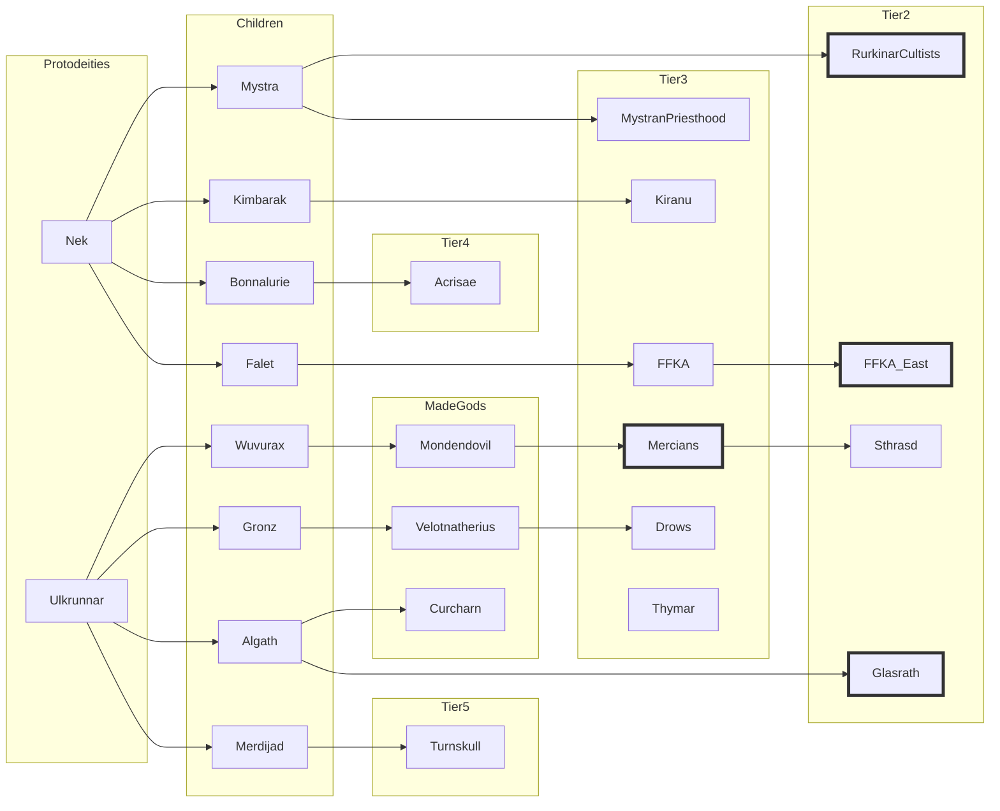

# Faction Game Log

## Current

```dataview
table without ID link(file.link, name) AS "Faction", id AS "ID", tier AS "Tier", power AS "Power", features AS "Feat", trouble AS "Trbl", cohesion AS "Cohs", dominion as "Domn", interest.glasrath AS "i1", interest.ffkaEast AS "i2", interest.mercians AS "i4", interest.turnskull as "i5", interest.acrisae as "i6"
from "arrival/factions"
WHERE contains(meta.category, "faction")=true OR contains(type, "faction")=true
WHERE meta.active = true
sort id asc
```


### Next 3878.7C1


### Until 3878.7C1, faction turn x6 - 3 of 3
### Until 3878.7C1, faction turn x6 - 2 of 3
### Until 3878.7C1, faction turn x6 - 1 of 3
- Order: 1, 2, 3, 4, 5, 6
- **Glasrath**
	- INT build strength - 1d8 DC 3 to get 1 dominion, outcome 1 - fail
	- EXT extend interest rurkinar: extend trade route (Whursock) - automatic x 6
	- EXT extend interest mercians: make some dark partnership - automatic x 6
	- EXT extend interest acrisae: start trading - automatic x 6
	- EXT extend interest turnskull: start trading - automatic x 6
- **FFKA East**
	- INT build strength - 1d8 DC 4 to get 1 dominion, outcome 1 - fail
	- EXT finish the Rurkinar: 1d8 Vs 1d8 (-4 interest), outcome 2>0 - succeed x 6: Rurkinar are liquidated.
	- EXT extend interest mercians: bully the mercians so they are watchful in Linhe - 1d8 Vs 1d10 (-4 interest), 3>0 - succeed x6
	- EXT extend interest glasrath: make contact with them to get info - 1d8 Vs 1d8, 7>1 - succeed x6
- **Mercians**
	- INT build strength - 1d10 DC 5 to get 2 dominion, outcome 1 - fail
	- EXT extend interest glasrath: expansion towards the mountains - automatic x6
	- EXT extend interest ffka: manipulate them - 1d10 Vs 1d8 (-4 interest), result 2>0 - pass x6
	- EXT extend interest acrisae: measure them up for future hostilities - 1d10 Vs 1d12 , result 5>3 - pass x6
- **Turnskull**
	- INT build strength - 1d20 DC 7 to get 3 dominion, outcome 3 - fail
	- EXT Glasrath - extend interest: start trading - automatic x6
	- EXT FFKA East - N/A
	- EXT Mercians - N/A
	- EXT Acrisae - attack 1d20 Vs 1d12 (-4 interest from Turnskull, +4 from Glasrath): 7>6 success x6: lost 3 cohesion, gained 3 pt problem
- **Acrisae**
	- INT build strength - 1d12 DC 5 (+2 interest from Glasrath) to get 2 dominion, outcome 10 - success x6
	- EXT Glasrath - extend interest: start trading - automatic x6
	- EXT FFKA East - extend interest: help each other - automatic x6
	- EXT Mercians - N/A
	- EXT Turnskull - attack 1d12 Vs 1d20 (-4 interest from Acrisae, +4 from Glasrath): 10>6 success x6: lost 4 cohesion, gained 2 pt problem
- **Background actors**
	- Kiranu and Nurderad cannot take Glasrath down, the dwarves have settled Durnum and the Nurderad had come home to prepare defences for a possible Turnskull attack.
	- Miraak, Kethra, Werebear and Nurderad Outcast face Ghuse. They are successful and hurt the faction. Miraak and Kethra are imprisoned, the others are killed.

### 3877.6F1
- Order: 1, 2, 4, 3
- Glasrath:
	- INT build strength - 1d8 DC 3 to get 1 dominion, outcome 1 - fail
	- EXT extend interest rurkinar: extend trade route (Whursock) - automatic
	- EXT extend interest mercians: make some dark partnership - automatic
- FFKA East:
	- INT build strength - 1d8 DC 4 to get 1 dominion, outcome 2 - fail
	- EXT attack Rurkinar: try to incarcerate Otaehryn Valdove (chieftan) in linhe - 1d8 Vs 1d8, outcome 7>6 - succeed
	- EXT extend interest mercians: bully the mercians so they are watchful in Linhe - 1d8 Vs 1d10, 6<3 - succeed
	- EXT extend interest glasrath: make contact with them to get info - 1d8 Vs 1d8, 6>1 - succeed, now the FFKA is preparing to attack Glasrah 
- Mercians
	- INT enact change (start uncreation in Linhe with the void umbilicals) - 1d10 DC 4, outcome 8 - succeed: Ethux'zhurh is now connected to the Brezal path
	- EXT extend interest glasrath: expansion towards the mountains - automatic
	- EXT attack Rurkinar: Ravage the land of the Rurkinar: 1d10 Vs 1d8, outcome 1<8 - fail
	- EXT extend interest ffka: manipulate them - 1d10 Vs 1d8, result 5>2 - pass
- Rurkinar
	- INT build strength - 1d8 DC 6 to get 1 dominion, outcome 3 - fail
	- EXT extend interest glasrah: extend trade route - automatic
	- EXT extend interest mercians: protection prayer for Linhe - 1d8 Vs 1d10, outcome 8=8 - fail as ties goes to higher powered factions
- Background actors
	- Ushulx carries out the ritual and kills Scar
	- Refiling locations: Temple of remains. 1 in 6 a faction takes it, 2 in 6 a wandering group takes it, result 2 - Anaks.

### 3877.6A6

- Order: 4, 2, 3, 1
- Mercians
	- INT build strength - 1d10 DC 4 to get 2 dominion, outcome 8 - pass
	- EXT extend interest glasrath: expansion towards the mountains - automatic #info 
	- EXT attack Rurkinar: Ravage the land of the Rurkinar: 1d10 Vs 1d8, outcome 10>1 - loose cohesion #info
	- EXT extend interest ffka: manipulate them - 1d10 Vs 1d8, result 10>1 - pass #info
- FFKA East
	- INT build strength - 1d8 DC 4 to get 1 dominion, outcome 3 - fail
	- EXT attack Rurkinar: try to incarcerate Otaehryn Valdove (chieftan) in linhe - 1d8 Vs 1d8, outcome 3<5 - fail again
	- EXT extend interest mercians: bully the mercians so they are watchful in Linhe - 1d8 Vs 1d10, 2<4 - fail, mercians are too dodgy
	- EXT extend interest glasrath: make contact with them to get info - 1d8 Vs 1d8, 6=6 - fail
- Rurkinar
	- INT build strength - 1d8 DC 6 to get 1 dominion, outcome 1 - fail
	- EXT extend interest glasrah: extend trade route - automatic #info
	- EXT extend interest mercians: protection prayer for Linhe - 1d8 Vs 1d10, outcome 5<6 - no change, not enough followers for the prayer
	- EXT attack FFKA East: create convulsion in the city of Linhe, disorganise the FFKA - 1d8 vs 1d8, outcome 1<4 - fail
- Glasrath
	- INT enact change (remove problem) 1d8 roll <= 3, outcome 3 - pass: number of undead greatly surpasses the number of alive people (2-to-1), mostly working the mines. Singlestrike joins support for Ghuse and population is mostly in full support (about 200 soldiers and guards are supporting). If characters haven't noticed yet, they notice now, that people are looking more pale and seem a bit brain drained. #info
	- EXT extend interest rurkinar: extend trade route (Whursock) - automatic #info
	- EXT extend interest mercians: make some dark partnership - automatic #info
- Background actors (wwn334)
	- [Ushulx]npcs/ushulx.md) has built a sacrifice altar for [Scar]npcs/scar.md) in the catacomb room, and will use the ritual (to be performed after 6D1) to ask Algath where Aivridyt can be found (DC 17 roll).

### 3877.5F

- Order: 3, 1, 2, 4
- Rurkinar
	- INT build strength - 1d8 DC 6 to get 1 dominion, outcome 6 - pass
	- EXT extend interest glasrah: extend trade route - automatic #info
	- EXT extend interest mercians: protection prayer for Linhe - 1d8 Vs 1d10, outcome 2 Vs 9 - no change, not enough followers for the prayer
- Glasrath
	- INT build strength - 1d8 DC 4 to get 1 dominion, outcome 8 - pass
	- EXT extend interest rurkinar: extend trade route (Whursock) - automatic #info
	- EXT extend interest mercians: make some dark partnership - automatic #info
- FFKA East
	- INT build strength - 1d8 DC 4 to get 1 dominion, outcome 2 - fail
	- EXT attack Rurkinar: try to incarcerate Otaehryn Valdove (chieftan) in linhe - 1d8 Vs 1d8, outcome 1 Vs 4 - no change #info
	- EXT extend interest mercians: bully the mercians so they are watchful in Linhe - 1d8 Vs 1d10, 3 Vs 7 - no change, Mercians are too dodgy
- Mercians
	- INT build strength - 1d10 DC 4 to get 2 dominion, outcome 4 - pass
	- EXT extend interest glasrath: expansion towards the mountains - automatic #info 
	- EXT extend interest rurkinar: watchful of each other - 1d10 Vs 1d8, result 8 Vs 3 - pass #info
	- EXT extend interest ffka: manipulate them - 1d10 Vs 1d8, result 7 Vs 6 - pass #info


### 3877.5B

**Actions and updates**
- Glasrath
	- **INT Build strength**: 1d8 DC 4 to get 1 dominion. Outcome 5.
- Rurkinar
	- **INT Enact change**: spend 2 dominion to get the feature to communicate with Rurkinar, 1d8 DC 4 to get the feature. Outcome 8.
	- **Updates:**
		- Scene with the communication with Rurkinar and the new madness of the high shaman to happen in chapter.
		- The foil of the ritual should also create a new problem for the Rurkinar Cultists, maybe there is a big fight with the FFKA - to be detailed in chapter.
- FFKA East
	- **INT Build strength**: 1d8 DC 4 to get 1 dominion. Outcome 5.
	- **EXT Attack rival**: Foil Rurkinar's ritual by imposing military presence during the ritual and imprison the cultists' shaman, 1d8 vs 1d8. Outcome 8 x 5: a new problem is acquired for the Ruirkinar.
- Mercians
	- **INT Build strength**: 1d10 DC 4 to get 2 dominion. Outcome 7.

**Summary before actions**

| Faction   | Tier | Feat | Trouble | Cohesion | Dominion |
| --------- | ---- | ---- | ------- | -------- | -------- |
| FFKA East | 2    | 2    | 3       | 2        | 0        |
| Glasrath  | 2    | 2    | 3       | 2        | 2        |
| Mercians  | 3    | 4    | 3       | 3        | 10       |
| Rurkinar  | 2    | 1    | 3       | 2        | 2        |

### 3877.4E
***State of play in Part 2***




* Human factions pressing on the Nulfirth people
    * Mercian culture expanding and gaining territory NE -> SW
        * Which includes the introduction of the Lady Scurvy disease in the capital of Katho
    * FFKA extending and gaining territory NW -> SE
        * Which includes a failed attempt to take over the Holzander castle from the Mercian
* The Trow advancing from the south with his army of cannibal giants and devils towards Katho
    * Trow expanding from the south, in declared war with Katho
    * Katho not able to protect the region due to the disease in the capital, the southern provinces have to deal with the Trow without aid
    * Thymar will respond and help in the war
    * Kiranu will respond and help in the war, but populations might need to migrate
* Aivridyt taking dominion in the Glasrath mountains, and travelling back and forth to the Dark Lake to look after her eggs
* Acrisae set in the middle, pushing peoples to the borders to avoid the enemy knowing their position and intent
