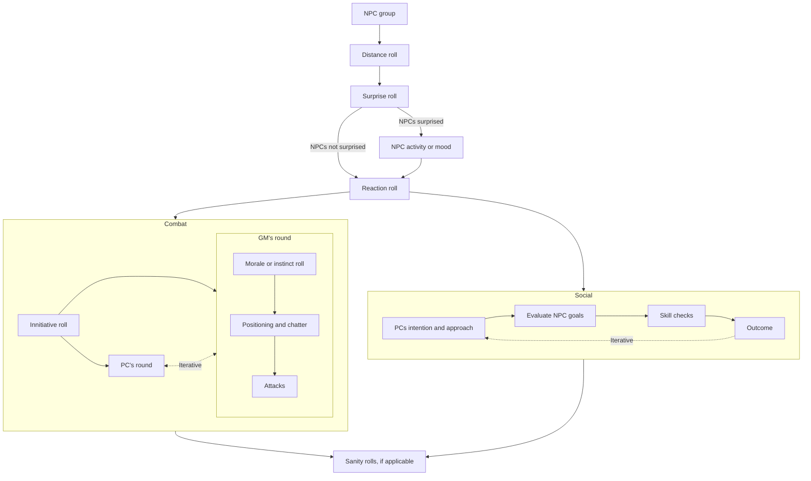

# Foes Without Number
***To be run with 5e and WN games. Inspiration: Forge of Foes.***

## Foes construction

### Rank

Choose a hit dice level, and use the table below as a starting point. Each HD is a 0.1 rank.

### Concept words

Choose 2 words, to determine the concept of a foe. Use Godbound's words or FoF's roles for this step.

Think of the foes's nature as well. If it is a metadimensional creature of raw energy, reflected on current world (such as Angels, uncreated beings, Codex' shadows) or if it has worldly powers such as psionic or magic. 

### Uncanny powers

Creatures can (and should) have their stats modified from the template to reflect mightier or lesser capabilities at the same challenge rank. **Choose what makes sense for the world.** An evaluation of creature degrees of power as table below (`HD / 2` is a good *soft* guideline). A point-buy system for additional effects (based on WWN powers, 5e's MM, Forge of Foes, Godbound Words) can be used.

| Modification      | Description                                                       | Weak (-1)             | Strong (+1)                                 |
| ----------------- | ----------------------------------------------------------------- | --------------------- | ------------------------------------------- |
| **Size**          | Sheer size affects sturdiness Each size change costs 1 point | d4 tiny d6 small | d10 large d12 huge d20 gargantuan (+2) |
| **Armour class**  | Improved armour or skin                                           | -2 AC                 | +2 AC                                       |
| **Attack and DC** | Fighting and magical prowess                                      | -2 Atk, -2 DC         | +2 Atk, +2 DC                               |
| **Damage output** | Ability to cause damage                                           | -1 / HD               | +1 / HD                                     |
| **Saving throws** | Readiness and resolve                                             | -2                    | +2                                          |
| **Effort**        | Capacity to use powers                                            | -2                    | +2                                          |
| **Powers**        | Different powers available                                        |                       | GB Gifts (greater: +2) (Consider WWN and 5e)                                            |

Link powers, strategies, behaviour, etc. to their words. [Link to Words and Gifts spreadsheet.](https://docs.google.com/spreadsheets/d/1sAebjMdjvWInmE15xIJ0Tt1pNnaA7fF_PYq_7o8HB_k/edit#gid=0). WWN powers, 5e MM powers, Godbound Gifts (lesser: 1, greater: 2) and Impairing Powers (pp169).

### Morale and Instinct

Morale conversions and roll
- 5e: 8 + 1/2 best(WIS|CHA) modifier, rounded up.
- WN: as bestiary stats.
- 2d8 system: multiply by 3/4
- Roll as WN rules (2d6 equal or under to pass)

Instinct conversions and roll
- 5e: 8 + 1/2 INT modifier, rounded up
- WN: 12 - Instinct
- 2d8 system: multiply by 3/4
- Roll 2d6 equal or under to pass

## Rank and HD Gauges

| Rank | HD gauge |
| ---- | -------- |
| 0    | 3-4      |
| 1    | 10       |
| 2    | 20       |
| 3    | 30       |
| 4    | 40       |
| 5    | 50       |
| 6    | 60       |

## NPC interaction procedure

