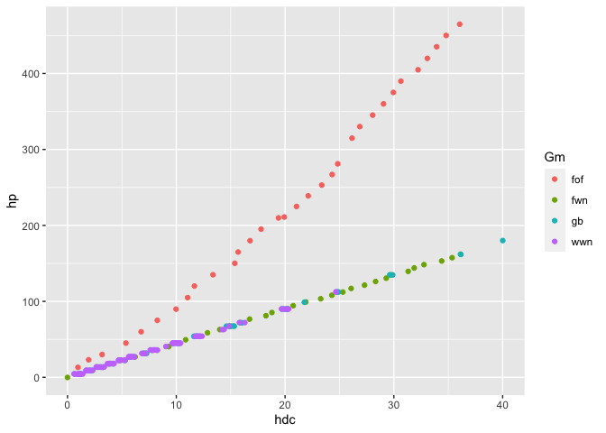
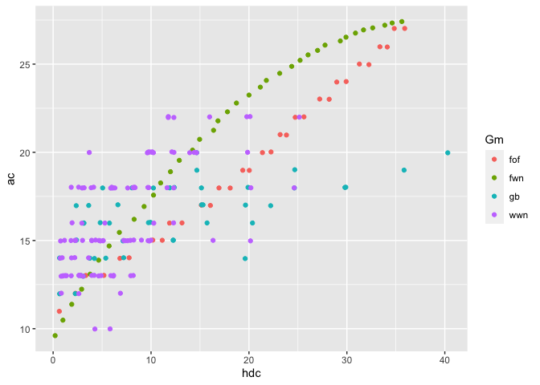
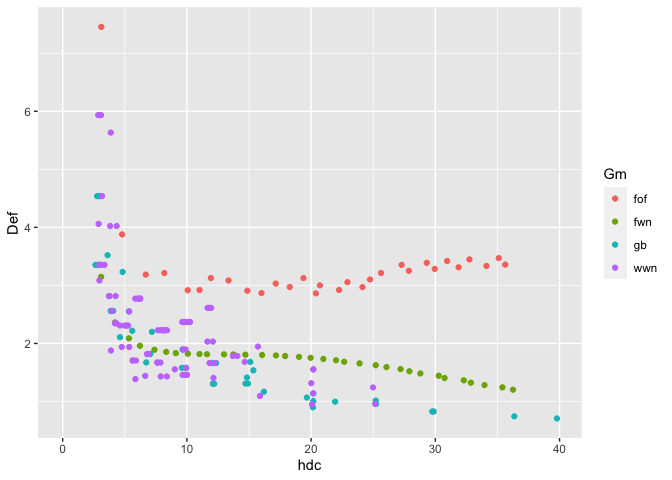
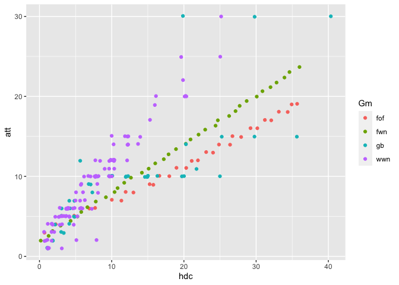
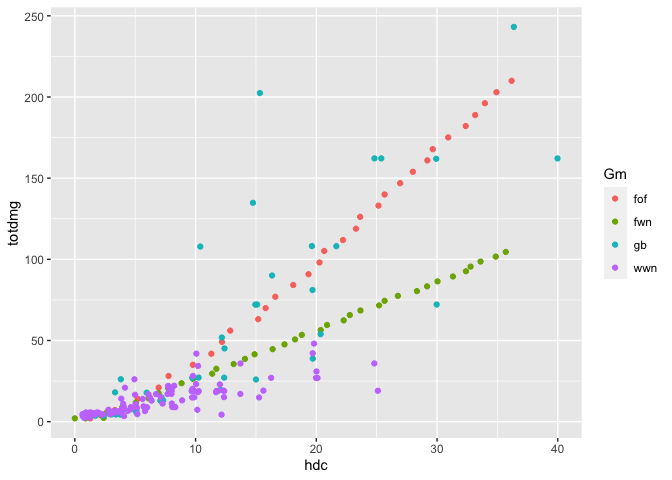
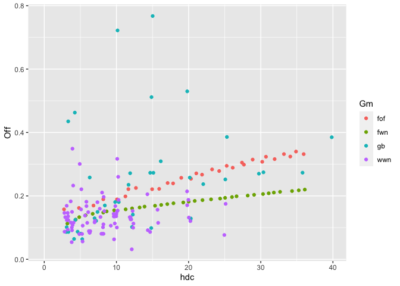

## Load and prepare data from Google Drive

``` r
fwnDB <- read_sheet('https://docs.google.com/spreadsheets/d/1xNTaAdvtE6mzDjzXhSQeA5TbIZo3pFzNen6mlMcThRA/edit#gid=1451095377')
```

    ## ! Using an auto-discovered, cached token.

    ##   To suppress this message, modify your code or options to clearly consent to
    ##   the use of a cached token.

    ##   See gargle's "Non-interactive auth" vignette for more details:

    ##   <]8;;https://gargle.r-lib.org/articles/non-interactive-auth.htmlhttps://gargle.r-lib.org/articles/non-interactive-auth.html]8;;>

    ## ℹ The googlesheets4 package is using a cached token for
    ##   ']8;;mailto:estevao.alvarenga@gmail.comestevao.alvarenga@gmail.com]8;;'.

    ## ✔ Reading from "FWN standards".

    ## ✔ Range 'db'.

``` r
fwnDB4plot <- fwnDB %>%
  select(hdc, hp, ac, dc, att, totdmg, Gm, Off, Def) %>%
  pivot_longer(cols = c('hp', 'ac', 'dc', 'att', 'totdmg', 'Off', 'Def'),
               names_to = 'variable',
               values_to = 'value')  
```

## Deffensive

Standard deffensive statistics:

``` r
fwnDB4plot %>%
  filter(variable == 'hp') %>%
  ggplot(aes(x = hdc, y = value, colour = Gm)) +
  geom_jitter() +
  labs(y = 'hp')
```



``` r
fwnDB4plot %>%
  filter(variable == 'ac') %>%
  ggplot(aes(x = hdc, y = value, colour = Gm)) +
  geom_jitter() +
  labs(y = 'ac')
```



With expected deffensive rates:

``` r
fwnDB4plot %>%
  filter(variable == 'Def') %>%
  ggplot(aes(x = hdc, y = value, colour = Gm)) +
  geom_jitter() +
  labs(y = 'Def')
```

    ## Warning: Removed 28 rows containing missing values (`geom_point()`).



## Offensive

Standard offensive statistics:

``` r
fwnDB4plot %>%
  filter(variable == 'att') %>%
  ggplot(aes(x = hdc, y = value, colour = Gm)) +
  geom_jitter() +
  labs(y = 'att')
```



``` r
fwnDB4plot %>%
  filter(variable == 'totdmg') %>%
  ggplot(aes(x = hdc, y = value, colour = Gm)) +
  geom_jitter() +
  labs(y = 'totdmg')
```



With expected deffensive rates:

``` r
fwnDB4plot %>%
  filter(variable == 'Off') %>%
  ggplot(aes(x = hdc, y = value, colour = Gm)) +
  geom_jitter() +
  labs(y = 'Off')
```

    ## Warning: Removed 28 rows containing missing values (`geom_point()`).


