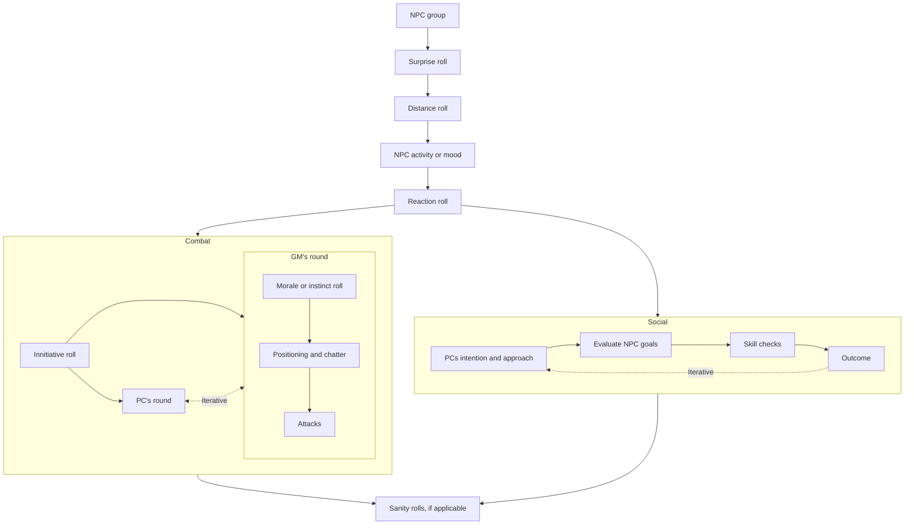

# Foes Without Number
***To be run with 5e and WN games. Inspiration: Forge of Foes.***

## Uncanny powers

Creatures can (and should) have their stats modified from the template to reflect mightier or lesser capabilities at the same challenge rank. **Choose what makes sense for the world.** An evaluation of creature degrees of power as table below (`HD / 2` is a good *soft* guideline). A point-buy system for additional effects (based on WWN powers, 5e's MM, Forge of Foes, Godbound Words) can be used.

| Modification      | Description                                                       | Weak (-1)             | Strong (+1)                                 |
| ----------------- | ----------------------------------------------------------------- | --------------------- | ------------------------------------------- |
| **Size**          | Sheer size affects sturdiness Each size change costs 1 point | d4 tiny d6 small | d10 large d12 huge d20 gargantuan (+2) |
| **Armour class**  | Improved armour or skin                                           | -2 AC                 | +2 AC                                       |
| **Attack and DC** | Fighting and magical prowess                                      | -2 Atk, -2 DC         | +2 Atk, +2 DC                               |
| **Damage output** | Ability to cause damage                                           | -1 / HD               | +1 / HD                                     |
| **Saving throws** | Readiness and resolve                                             | -2                    | +2                                          |
| **Effort**        | Capacity to use powers                                            | -2                    | +2                                          |
| **Powers**        | Different powers available                                        |                       | GB Gifts (greater: +2) (Consider WWN and 5e)                                            |

Choose 2 words, to determine the concept of a creature. Link powers, strategies, behaviour, etc. to their words. [Link to Words and Gifts spreadsheet.](https://docs.google.com/spreadsheets/d/1sAebjMdjvWInmE15xIJ0Tt1pNnaA7fF_PYq_7o8HB_k/edit#gid=0). WWN powers, 5e MM powers, Godbound Gifts (lesser: 1, greater: 2) and Impairing Powers (pp169).

## Morale and Instinct

Morale conversions and roll
- 5e: 8 + 1/2 best(WIS|CHA) modifier, rounded up.
- WN: as bestiary stats.
- 2d8 system: multiply by 3/4
- Roll as WN rules (2d6 equal or under to pass)

Instinct conversions and roll
- 5e: 8 + 1/2 INT modifier, rounded up
- WN: 12 - Instinct
- 2d8 system: multiply by 3/4
- Roll 2d6 equal or under to pass

## Ranks and HD gauges

- Dungeon & crypt: rank 0, becoming rank 1 as undead advance
- scriptorium and furnace: rank 1, except for Ngar'tho 
- dwarven barracks: rank 2
- bat caves and diabolist: rank 2
- black river & howling halls: rank 3

NPC interaction procedure

| GM encounter roll            | Result                |
| ---------------------------- | --------------------- |
| Distance (in meters)         | `dice: (3d6 + 1) * 5` |
| Activity or mood             | `dice: 1d12`          |
| Wilderness or dungeon events | `dice: 1d20`          |
| Reaction                     | `dice: 2d6`           |
| Morale or instinct           | `dice: 2d6`           |

Distance source [1](https://thealexandrian.net/wordpress/46466/roleplaying-games/random-gm-tip-encounter-distance) and [2](https://anydice.com/program/30e17)
